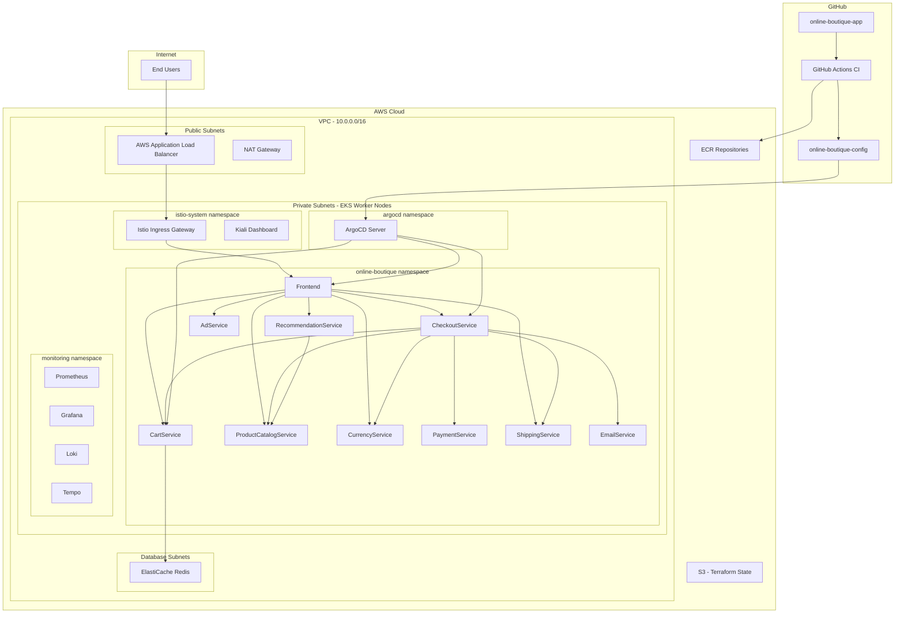
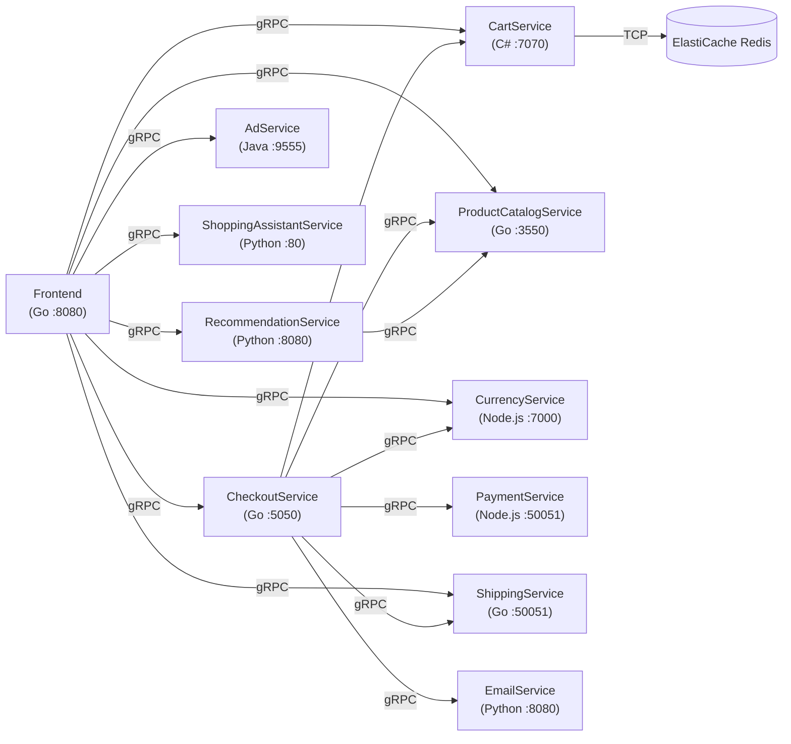
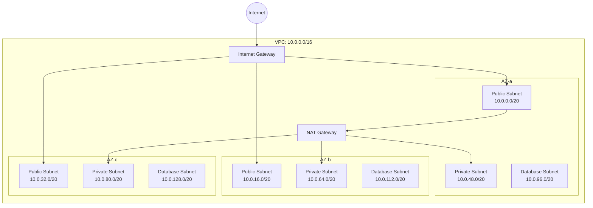
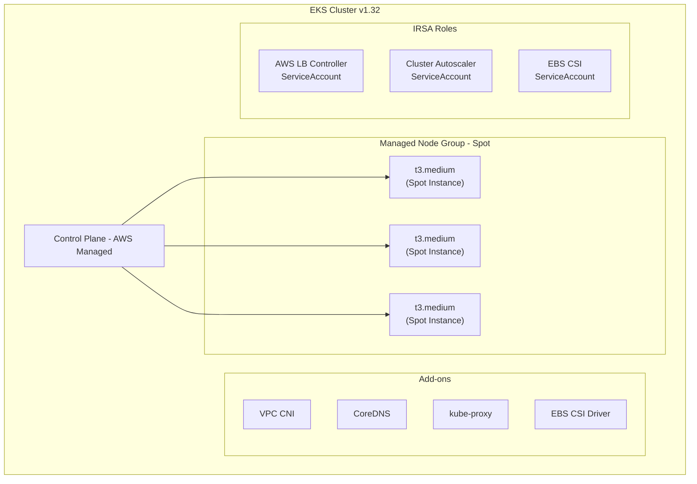
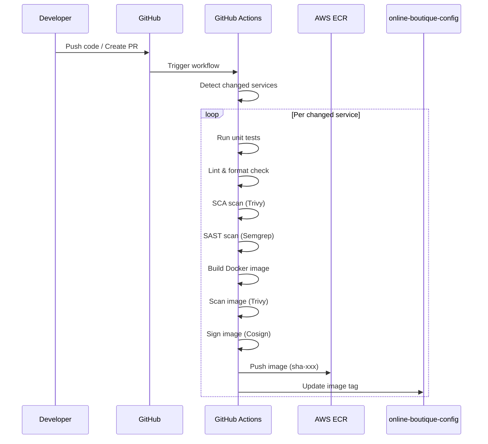
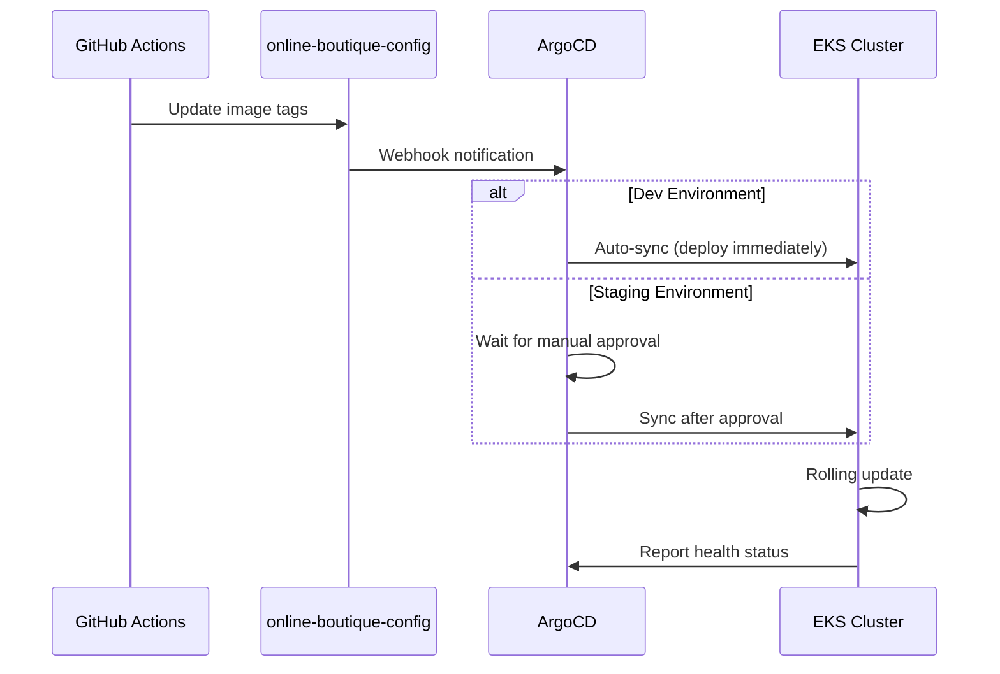
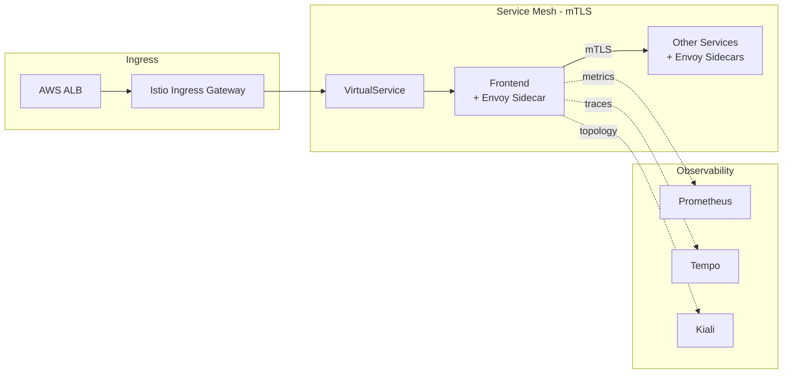
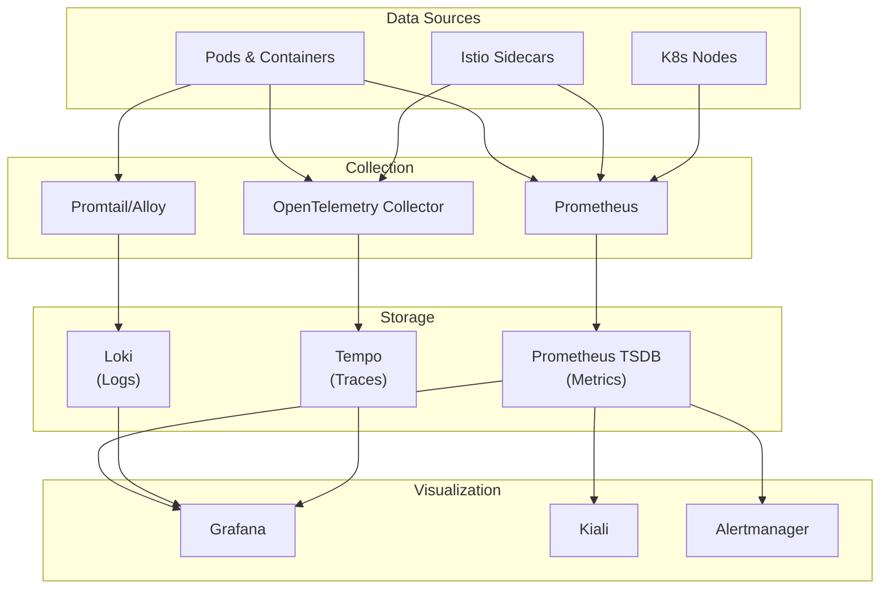
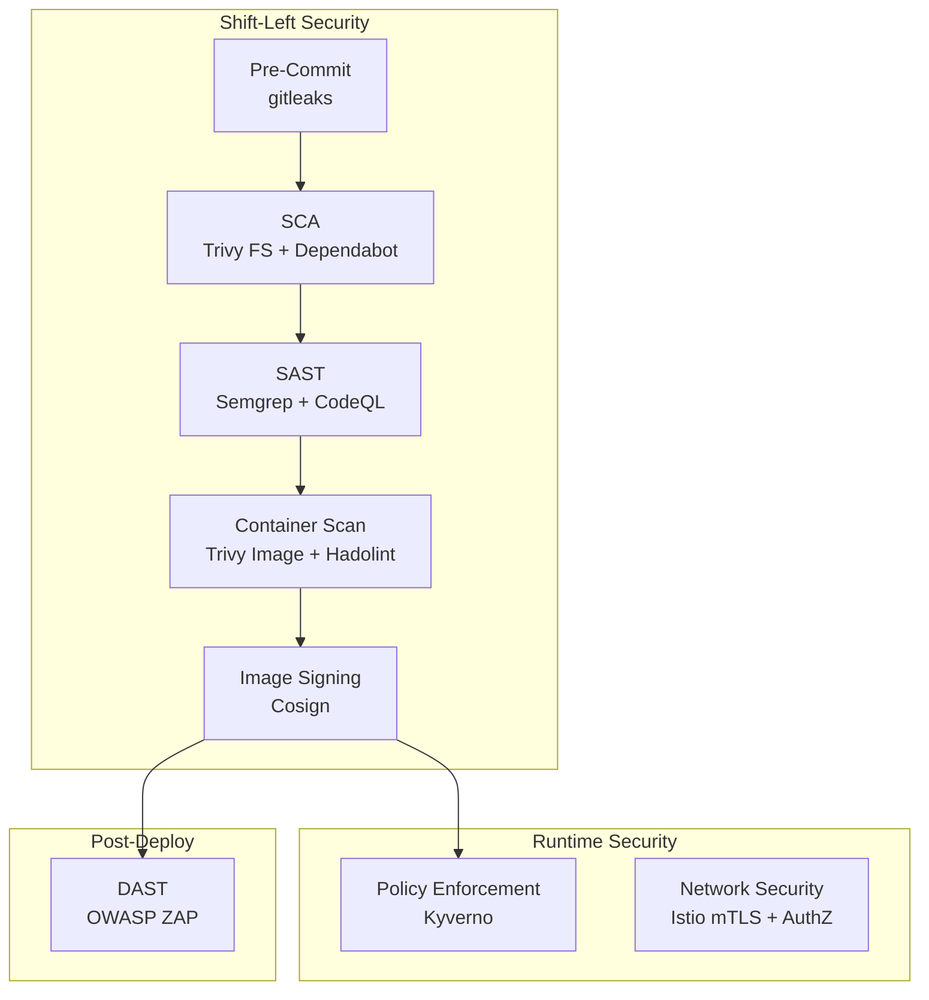
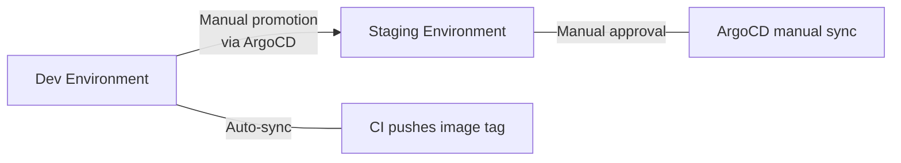

# 🏗️ Kiến Trúc Hệ Thống – Online Boutique on AWS

> **Ngày tạo:** 2026-10-02  
> **Phiên bản:** 1.0  
> **Dự án:** Online Boutique – DevOps End-to-End trên AWS

---

## 1. Tổng Quan

Online Boutique là ứng dụng e-commerce demo của Google Cloud gồm **12 microservices** được viết bằng nhiều ngôn ngữ khác nhau. Dự án này triển khai ứng dụng lên **AWS** với quy trình DevOps hoàn chỉnh, bao gồm Infrastructure as Code, CI/CD, Service Mesh, Monitoring và Security.

### 1.1 Kiến Trúc Tổng Thể

---

## 2. Kiến Trúc Microservices

### 2.1 Service Map

### 2.2 Chi Tiết Từng Service

| Service | Ngôn ngữ | Port | Protocol | Mô tả | Dependencies |
|---------|----------|------|----------|--------|-------------|
| **frontend** | Go | 8080 | HTTP | Web UI cho end users | Tất cả services |
| **cartservice** | C# (.NET) | 7070 | gRPC | Quản lý giỏ hàng | ElastiCache Redis |
| **checkoutservice** | Go | 5050 | gRPC | Xử lý thanh toán & đặt hàng | cart, product, currency, payment, shipping, email |
| **productcatalogservice** | Go | 3550 | gRPC | CRUD danh mục sản phẩm | Không |
| **currencyservice** | Node.js | 7000 | gRPC | Chuyển đổi tiền tệ | Không |
| **paymentservice** | Node.js | 50051 | gRPC | Xử lý thanh toán (mock) | Không |
| **shippingservice** | Go | 50051 | gRPC | Tính phí vận chuyển | Không |
| **emailservice** | Python | 8080 | gRPC | Gửi email xác nhận | Không |
| **recommendationservice** | Python | 8080 | gRPC | Gợi ý sản phẩm | productcatalogservice |
| **adservice** | Java | 9555 | gRPC | Hiển thị quảng cáo | Không |
| **shoppingassistantservice** | Python | 80 | gRPC | Trợ lý mua sắm AI | Không |
| **loadgenerator** | Python | — | HTTP | Tạo traffic giả lập | frontend |

---

## 3. Kiến Trúc Hạ Tầng AWS

### 3.1 Networking (VPC)

| Tầng | CIDR Range | Mục đích | Internet Access |
|------|-----------|----------|-----------------|
| **Public** | `10.0.0.0/20` – `10.0.32.0/20` | ALB, NAT Gateway, Bastion | Inbound + Outbound |
| **Private** | `10.0.48.0/20` – `10.0.80.0/20` | EKS Worker Nodes | Outbound qua NAT |
| **Database** | `10.0.96.0/20` – `10.0.128.0/20` | ElastiCache Redis | Không (isolated) |

### 3.2 EKS Cluster

| Tham số | Giá trị |
|---------|---------|
| **Version** | 1.32 |
| **Node Type** | t3.medium (Spot) |
| **Scaling** | Min: 2, Desired: 3, Max: 5 |
| **Encryption** | KMS cho Kubernetes Secrets |
| **Logging** | API, Audit, Authenticator, Controller Manager, Scheduler |
| **IRSA** | AWS LB Controller, Cluster Autoscaler, EBS CSI Driver |

### 3.3 Data Layer

| Component | Cấu hình |
|-----------|----------|
| **ElastiCache Redis** | Engine 7.1, Multi-AZ, 2 nodes |
| **Node Type** | cache.t3.micro |
| **Encryption** | At-rest enabled |
| **Backup** | Daily snapshots, 7 days retention |

---

## 4. Kiến Trúc CI/CD

### 4.1 CI Pipeline (GitHub Actions)

### 4.2 CD Pipeline (ArgoCD + GitOps)

### 4.3 Repository Strategy

| Repository | Mục đích | Nội dung chính |
|-----------|----------|---------------|
| **online-boutique-app** | Source code + Infrastructure | `src/`, `infra/`, `.github/workflows/`, `devops/` |
| **online-boutique-config** | GitOps Configuration | ArgoCD apps, Kustomize base/overlays, Helm values |

---

## 5. Kiến Trúc Service Mesh (Istio)

### 5.1 Traffic Flow

### 5.2 Security Layers

| Layer | Mechanism | Mô tả |
|-------|-----------|--------|
| **Transport** | mTLS (STRICT) | Mã hóa toàn bộ traffic service-to-service |
| **Authentication** | PeerAuthentication | Xác thực identity qua mTLS certificates |
| **Authorization** | AuthorizationPolicy | Whitelist service-to-service communication |
| **Traffic** | VirtualService + DestinationRule | Routing, retries, timeouts, circuit breaking |

---

## 6. Kiến Trúc Monitoring & Observability

### 6.1 Ba Trụ Cột

| Trụ cột | Tool | Storage | Query Language |
|---------|------|---------|---------------|
| **Metrics** | Prometheus | TSDB | PromQL |
| **Logs** | Loki + Promtail | Object Storage | LogQL |
| **Traces** | Tempo + OTel Collector | Object Storage | TraceQL |

---

## 7. Kiến Trúc Security (DevSecOps)

### 7.1 Security Pipeline

### 7.2 Security Controls Matrix

| Giai đoạn | Tool | Loại | Mục đích |
|-----------|------|------|----------|
| Pre-commit | gitleaks | Secret Scan | Phát hiện secrets trong code |
| Build | Trivy (fs) | SCA | Quét CVEs trong dependencies |
| Build | Dependabot | SCA | Auto-update vulnerable dependencies |
| Build | Semgrep | SAST | Phân tích mã nguồn tìm lỗ hổng |
| Build | CodeQL | SAST | Deep semantic code analysis |
| Build | Hadolint | Dockerfile Lint | Best practices cho Dockerfile |
| Build | Trivy (image) | Container Scan | Quét CVEs trong Docker images |
| Build | Cosign | Image Signing | Ký xác thực Docker images |
| Runtime | Kyverno | Policy Engine | Enforce K8s security policies |
| Runtime | Istio | Network Security | mTLS, AuthZ policies |
| Post-deploy | OWASP ZAP | DAST | Quét lỗ hổng ứng dụng đang chạy |

---

## 8. Environments

### 8.1 So Sánh Environments

| Tham số | Dev | Staging |
|---------|-----|---------|
| **Mục đích** | Development & testing | Pre-production validation |
| **ArgoCD Sync** | Auto | Manual approval |
| **EKS Nodes** | 3 Spot (t3.medium) | 3 Spot (t3.medium) |
| **Redis** | 2 nodes (Multi-AZ) | 2 nodes (Multi-AZ) |
| **DAST Scan** | Không | OWASP ZAP full scan |
| **Istio mTLS** | STRICT | STRICT |
| **Monitoring** | Full stack | Full stack |

### 8.2 Promotion Flow

---

## 9. Ước Tính Chi Phí (USD/tháng)

| Tài nguyên | Dev | Staging | Tổng |
|------------|-----|---------|------|
| EKS Control Plane | $73 | $73 | $146 |
| EC2 Spot (3x t3.medium) | ~$30 | ~$30 | ~$60 |
| ElastiCache (2x cache.t3.micro) | ~$25 | ~$25 | ~$50 |
| NAT Gateway | ~$33 | ~$33 | ~$66 |
| ALB | ~$18 | ~$18 | ~$36 |
| S3 + DynamoDB (state) | < $1 | — | ~$1 |
| CloudWatch Logs | ~$5 | ~$5 | ~$10 |
| ECR | ~$2 | — | ~$2 |
| **Tổng ước tính** | **~$186** | **~$184** | **~$370** |

> [!WARNING]
> Đây là ước tính sơ bộ. Chi phí thực tế có thể thay đổi tùy thuộc vào usage, region, và Spot pricing.  
> **Tip:** Có thể tắt staging environment khi không sử dụng để tiết kiệm ~50% chi phí.

---

## 10. Quy Ước Đặt Tên

| Tài nguyên | Pattern | Ví dụ |
|------------|---------|-------|
| VPC | `{project}-{env}-vpc` | `online-boutique-dev-vpc` |
| Subnet | `{project}-{env}-{tier}-{az}` | `online-boutique-dev-private-ap-southeast-1a` |
| EKS Cluster | `{project}-{env}` | `online-boutique-dev` |
| ECR Repository | `{project}/{service}` | `online-boutique/frontend` |
| ElastiCache | `{project}-{env}` | `online-boutique-dev` |
| IAM Role | `{cluster}-{purpose}` | `online-boutique-dev-aws-lb-controller` |
| K8s Namespace | `{app-name}` | `online-boutique`, `monitoring`, `argocd` |
