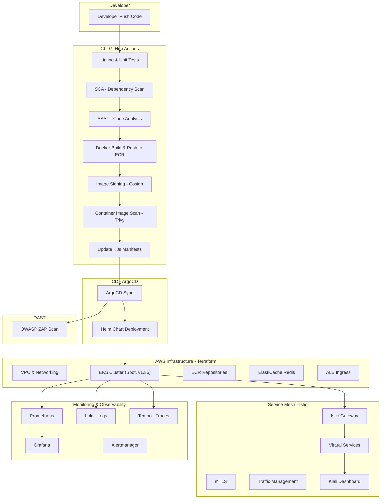
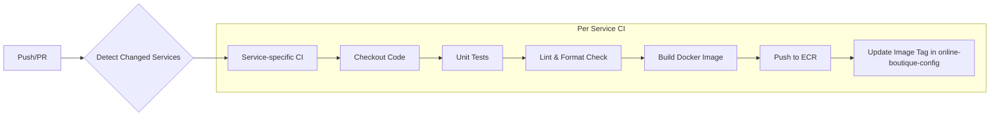
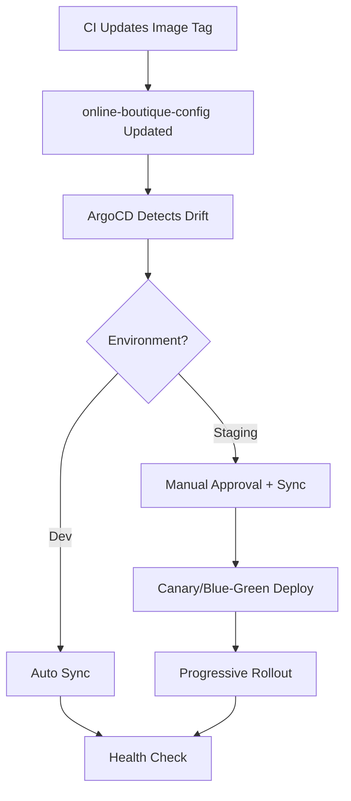
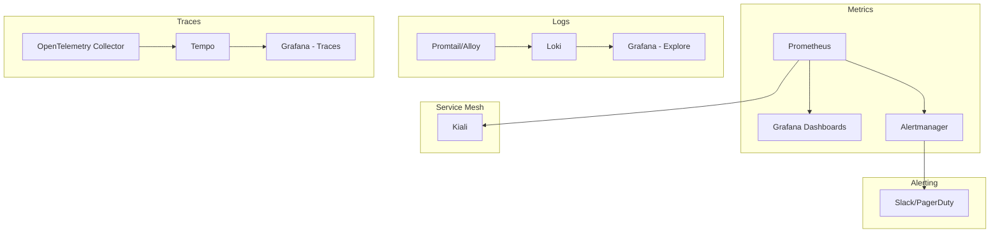
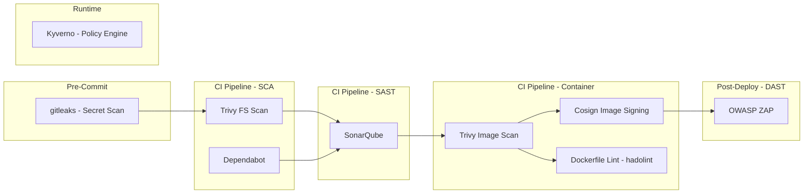
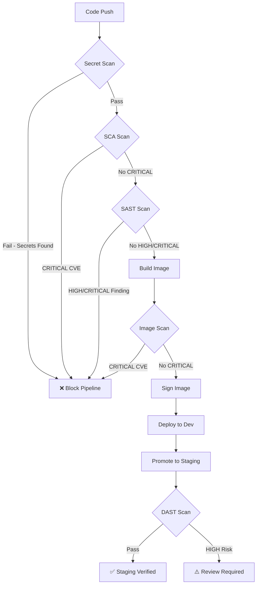
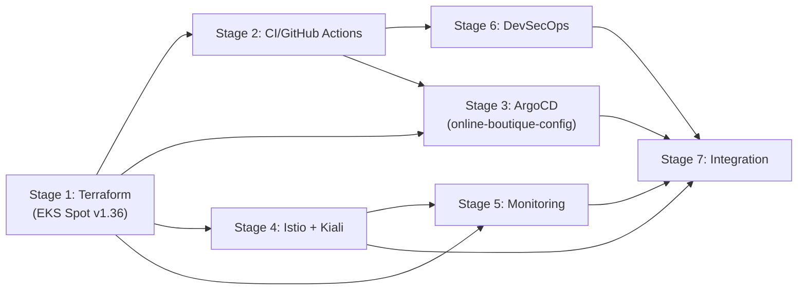

# 🚀 Kế hoạch triển khai project DevOps – Online Boutique trên AWS

## Tổng Quan Dự Án

Triển khai ứng dụng **Google Online Boutique** (12 microservices) lên hạ tầng AWS với quy trình DevOps hoàn chỉnh end-to-end.

### Cấu trúc Repositories

```
online-boutique/
├── online-boutique-app/           # Source code + Infra (repo hiện tại)
│   ├── src/                       # 12 microservices
│   ├── terraform-aws/             # Terraform modules & environments
│   ├── devops/                    # 📝 Documentation theo từng stage
│   ├── .github/workflows/         # CI pipelines
│   └── ...
└── online-boutique-config/        # GitOps config (repo riêng)
    ├── apps/                      # ArgoCD Application definitions
    ├── base/                      # Base manifests
    ├── overlays/                  # Environment overlays (dev, staging)
    └── ...
```

### Kiến Trúc Microservices Hiện Tại

| Service | Ngôn ngữ | Port | Mô tả |
|---------|----------|------|--------|
| `frontend` | Go | 8080 | Web UI, gateway cho user |
| `cartservice` | C# (.NET) | 7070 | Quản lý giỏ hàng (Redis) |
| `productcatalogservice` | Go | 3550 | Danh mục sản phẩm |
| `currencyservice` | Node.js | 7000 | Chuyển đổi tiền tệ |
| `paymentservice` | Node.js | 50051 | Xử lý thanh toán |
| `shippingservice` | Go | 50051 | Tính phí vận chuyển |
| `emailservice` | Python | 8080 | Gửi email xác nhận |
| `checkoutservice` | Go | 5050 | Xử lý checkout |
| `recommendationservice` | Python | 8080 | Gợi ý sản phẩm |
| `adservice` | Java | 9555 | Quảng cáo |
| `loadgenerator` | Python | — | Tạo traffic giả lập |
| `shoppingassistantservice` | Python | 80 | Trợ lý mua sắm AI |

### Kiến Trúc Tổng Thể



### Thư mục Documentation (`devops/`)

```
devops/
├── plan.md                        # Bản kế hoạch này
├── git-convention.md              # Quy ước Git commit
├── architecture.md                # Kiến trúc tổng thể
├── stage-1-terraform.md           # Viết sau khi hoàn thành Stage 1
├── stage-2-ci-pipeline.md         # Viết sau khi hoàn thành Stage 2
├── stage-3-cd-argocd.md           # Viết sau khi hoàn thành Stage 3
├── stage-4-service-mesh.md        # Viết sau khi hoàn thành Stage 4
├── stage-5-monitoring.md          # Viết sau khi hoàn thành Stage 5
├── stage-6-devsecops.md           # Viết sau khi hoàn thành Stage 6
├── stage-7-integration.md         # Viết sau khi hoàn thành Stage 7
└── runbooks/                      # Operational runbooks
    ├── deploy.md
    ├── rollback.md
    ├── troubleshooting.md
    └── scaling.md
```

> Mỗi tài liệu stage sẽ bao gồm: mô tả kiến trúc, quyết định thiết kế, hướng dẫn sử dụng, cấu hình chi tiết, và bài học kinh nghiệm.

---

## 📋 Các Stage Triển Khai

---

## Stage 1: Thiết Lập Nền Tảng Terraform – Hạ Tầng AWS

> **Mục tiêu:** Định nghĩa toàn bộ hạ tầng AWS bằng Terraform với cấu trúc module hóa.
> **Thời gian ước tính:** 3-4 ngày

### 1.1 Cấu trúc thư mục Terraform

```
terraform-aws/
├── environments/
│   ├── dev/
│   │   ├── main.tf
│   │   ├── variables.tf
│   │   ├── terraform.tfvars.example
│   │   └── outputs.tf
│   └── staging/
│       ├── main.tf
│       ├── variables.tf
│       ├── terraform.tfvars.example
│       └── outputs.tf
├── modules/
│   ├── vpc/                      # VPC, Subnets, NAT, IGW, Flow Logs
│   ├── eks/                      # EKS Cluster, Node Groups (Spot), Addons
│   ├── ecr/                      # ECR Repositories cho 11 services
│   ├── elasticache/              # Redis cho CartService (Multi-AZ)
│   └── irsa/                     # IAM Roles for Service Accounts
└── global/
    ├── s3-backend/               # Bootstrap S3 state backend
    ├── ecr/                      # ECR repos (shared across envs)
    └── github-oidc/              # GitHub Actions OIDC + IAM roles
```

### 1.2 Chi tiết tài nguyên AWS

| Tài nguyên | Cấu hình | Ghi chú |
|------------|----------|---------|
| **VPC** | 3 AZs, Public/Private/DB Subnets, NAT Gateway | High availability |
| **EKS** | **v1.36**, Managed Node Groups (**Spot** – t3.medium x3) | IRSA, KMS encryption, VPC CNI prefix delegation, **Spot để tiết kiệm chi phí** |
| **ECR** | 11 repositories (1/service) | Lifecycle policy, scan on push, managed globally |
| **ElastiCache** | Redis 7.x, Multi-AZ, Encryption at rest | Thay thế in-cluster Redis |
| **S3** | Terraform state bucket | Versioning + KMS encryption + S3 native locking |
| **IAM** | EKS cluster role, node role, IRSA roles, GitHub OIDC | Least privilege |
| **ALB** | AWS Load Balancer Controller (via IRSA) | Ingress cho Istio Gateway |

> [!IMPORTANT]
> **EKS v1.36** được chọn vì nằm trong Standard Support đến 08/2027 (v1.32 trở xuống đã vào Extended Support, tính phí ~6x).
> **Spot Instances** giúp tiết kiệm ~60-70% chi phí so với On-Demand.

### 1.3 Cấu hình Environment

| Tham số | Dev | Staging |
|---------|-----|---------|
| Node Instance Types | `t3.medium` | `t3.medium` |
| Capacity Type | **SPOT** | **SPOT** |
| Node Desired/Min/Max | 3 / 2 / 5 | 3 / 2 / 5 |
| NAT Gateway | Single (tiết kiệm) | Single |
| Redis Node Type | `cache.t3.micro` | `cache.t3.micro` |
| Redis Clusters | 2 (Multi-AZ) | 2 (Multi-AZ) |
| VPC Flow Logs | Enabled | Enabled |

### 1.4 Deliverables
- [ ] Module VPC với 3 tầng subnet (public, private, database)
- [ ] Module EKS v1.36 với Spot managed node groups, VPC CNI prefix delegation và pinned add-ons
- [ ] Module ECR với lifecycle policies (global root module)
- [ ] Module ElastiCache Redis (Multi-AZ)
- [ ] Module IRSA (AWS LB Controller, Cluster Autoscaler)
- [ ] Remote state backend (S3 + native locking)
- [ ] GitHub Actions OIDC provider + IAM roles
- [ ] VPC Flow Logs
- [ ] Environment configs cho dev và staging
- [ ] Outputs: cluster endpoint, ECR URIs, Redis endpoint, VPC ID
- [ ] 📝 Documentation: `devops/stage-1-terraform.md`

---

## Stage 2: CI Pipeline – GitHub Actions

> **Mục tiêu:** Xây dựng pipeline CI tự động hóa build, test và push images.
> **Thời gian ước tính:** 3-4 ngày

### 2.1 Cấu trúc thư mục CI

```
.github/
├── workflows/
│   ├── ci-main.yml               # Orchestrator workflow
│   ├── ci-service.yml            # Reusable workflow cho mỗi service
│   ├── terraform-plan.yml        # Terraform plan trên PR
│   ├── terraform-apply.yml       # Terraform apply khi merge
│   └── security-scan.yml         # Scheduled security scans
├── actions/
│   ├── docker-build-push/        # Composite action: build + push ECR
│   └── update-manifests/         # Composite action: update image tags
└── CODEOWNERS
```

### 2.2 CI Pipeline Flow



### 2.3 Chi tiết Workflow

#### `ci-main.yml` – Orchestrator
- **Trigger:** Push to `main`, Pull Requests
- **Job 1 – Detect Changes:** Sử dụng `dorny/paths-filter` để phát hiện service nào thay đổi
- **Job 2 – Matrix Build:** Chạy `ci-service.yml` dạng matrix cho các service thay đổi

#### `ci-service.yml` – Reusable Per-Service Workflow
| Step | Tool | Mô tả |
|------|------|--------|
| Checkout | `actions/checkout@v4` | Clone code |
| Setup Language | `actions/setup-go`, `setup-node`, etc. | Cài đặt runtime |
| Cache Dependencies | `actions/cache` | Cache go modules, npm, pip |
| Unit Tests | `go test`, `dotnet test`, `npm test`, `pytest` | Run tests |
| Lint | `golangci-lint`, `eslint`, `pylint`, `checkstyle` | Code quality |
| Docker Build | `docker/build-push-action@v5` | Multi-platform build |
| Login ECR | `aws-actions/amazon-ecr-login` | Authenticate ECR |
| Push Image | Tag: `sha-<commit>`, `latest` | Push to ECR |
| Update Manifests | `yq` / custom script | Cập nhật image tag trong **online-boutique-config** repo |

#### `terraform-plan.yml`
- **Trigger:** PR thay đổi `terraform-aws/`
- Chạy `terraform fmt -check`, `terraform validate`, `terraform plan`
- Comment plan output vào PR

#### `terraform-apply.yml`
- **Trigger:** Merge vào `main` có thay đổi `terraform-aws/`
- Chạy `terraform apply -auto-approve`
- Chỉ chạy trên branch `main`

### 2.4 Deliverables
- [ ] Reusable workflow CI cho từng service với path filtering
- [ ] Docker build multi-stage tối ưu
- [ ] ECR push với proper tagging strategy (`sha-xxx`, `branch-name`, `latest`)
- [ ] Terraform plan/apply workflow
- [ ] GitHub Environments với approval gates cho staging
- [ ] Secrets management (AWS credentials, ECR, etc.)
- [ ] 📝 Documentation: `devops/stage-2-ci-pipeline.md`

---

## Stage 3: CD Pipeline – ArgoCD + GitOps

> **Mục tiêu:** Triển khai GitOps-based CD với ArgoCD, tách biệt hoàn toàn config khỏi source code.
> **Thời gian ước tính:** 2-3 ngày
> **Working directory:** `d:\online-boutique\online-boutique-config`

### 3.1 Cấu trúc GitOps Repository (`online-boutique-config`)

```
online-boutique-config/
├── argocd/                        # ArgoCD installation & config
│   ├── install/
│   │   └── values.yaml            # ArgoCD Helm values
│   ├── app-of-apps/
│   │   ├── dev.yaml               # App of Apps cho dev
│   │   └── staging.yaml           # App of Apps cho staging
│   └── argocd-apps/
│       ├── dev/
│       │   ├── frontend.yaml
│       │   ├── cartservice.yaml
│       │   └── ...
│       └── staging/
│           └── ...
├── base/                          # Base Kustomize manifests
│   ├── online-boutique/
│   │   ├── kustomization.yaml
│   │   └── *.yaml                 # Từ kubernetes-manifests/ gốc
│   └── infrastructure/
│       ├── istio/
│       ├── monitoring/
│       └── security/
├── overlays/                      # Environment-specific overlays
│   ├── dev/
│   │   ├── kustomization.yaml
│   │   └── patches/
│   └── staging/
│       ├── kustomization.yaml
│       └── patches/
└── README.md
```

### 3.2 ArgoCD Setup

| Component | Chi tiết |
|-----------|---------|
| **Installation** | Helm chart, namespace `argocd` |
| **Pattern** | App of Apps pattern |
| **Sync Policy** | **Auto-sync cho dev**, **Manual sync cho staging** |
| **Notifications** | Slack/Discord integration |
| **RBAC** | SSO via GitHub OAuth, role-based access |
| **Image Updater** | ArgoCD Image Updater tự động detect new images từ ECR |

### 3.3 Deployment Strategy



### 3.4 Deliverables
- [ ] ArgoCD installation via Helm trên EKS
- [ ] App of Apps pattern cho dev và staging
- [ ] Kustomize base manifests + overlays cho dev/staging
- [ ] ArgoCD Image Updater cấu hình cho ECR
- [ ] Sync policies (auto cho dev, manual cho staging)
- [ ] Notification integration (Slack/Teams)
- [ ] Rollback strategy documentation
- [ ] 📝 Documentation: `devops/stage-3-cd-argocd.md`

---

## Stage 4: Service Mesh – Istio + Kiali

> **Mục tiêu:** Cài đặt và cấu hình Istio cho traffic management, security (mTLS), observability và **Kiali** dashboard.
> **Thời gian ước tính:** 2-3 ngày

### 4.1 Istio + Kiali Installation

| Component | Chi tiết |
|-----------|---------|
| **Istio Installation** | `istioctl` hoặc Istio Operator, profile: `default` |
| **Namespace** | `istio-system` |
| **Ingress Gateway** | Tích hợp AWS ALB |
| **Sidecar Injection** | Label namespace: `istio-injection=enabled` |
| **Kiali** | Helm chart, namespace `istio-system`, tích hợp Prometheus + Grafana |

### 4.2 Cấu hình Chi tiết

```
istio/
├── installation/
│   ├── istio-operator.yaml        # IstioOperator CR
│   └── namespace.yaml
├── gateway/
│   ├── gateway.yaml               # Istio Gateway + AWS ALB annotations
│   └── virtual-services.yaml      # VirtualService cho frontend
├── security/
│   ├── peer-authentication.yaml   # STRICT mTLS
│   ├── authorization-policies.yaml # Service-to-service access control
│   └── request-authentication.yaml
├── traffic/
│   ├── destination-rules.yaml     # Load balancing, circuit breaker
│   ├── retry-policies.yaml        # Retry configuration
│   └── timeout-policies.yaml      # Timeout configuration
├── kiali/
│   └── values.yaml                # Kiali Helm values
└── observability/
    ├── telemetry.yaml             # Metrics, traces export config
    └── envoy-filter.yaml          # Custom Envoy filters (nếu cần)
```

### 4.3 Tính năng triển khai

| Tính năng | Cấu hình |
|-----------|----------|
| **mTLS** | `PeerAuthentication` mode: `STRICT` cho toàn mesh |
| **Traffic Management** | Canary deployment via `VirtualService` weight-based routing |
| **Circuit Breaker** | `DestinationRule` với outlier detection |
| **Rate Limiting** | `EnvoyFilter` hoặc Istio `RequestAuthentication` |
| **Access Control** | `AuthorizationPolicy` - whitelist service-to-service communication |
| **Observability** | Tự động export metrics/traces qua Envoy sidecar |
| **Kiali Dashboard** | Visualization service mesh topology, traffic flow, health status |

### 4.4 Kiali Dashboard Features

| Feature | Mô tả |
|---------|--------|
| **Graph** | Service mesh topology visualization, traffic animation |
| **Workloads** | Xem trạng thái pods, deployments, Istio configs |
| **Services** | Service details, inbound/outbound traffic |
| **Istio Config** | Validate VirtualServices, DestinationRules, Policies |
| **Health** | Health check dashboard cho toàn bộ mesh |

### 4.5 Deliverables
- [ ] Istio installation manifest (IstioOperator)
- [ ] Gateway + VirtualService cho frontend
- [ ] mTLS strict mode cho toàn namespace
- [ ] Authorization policies (least privilege service-to-service)
- [ ] DestinationRules với circuit breaking
- [ ] Traffic management configs (canary routing weights)
- [ ] **Kiali dashboard** cài đặt và cấu hình
- [ ] Kiali tích hợp với Prometheus, Grafana, Tempo
- [ ] 📝 Documentation: `devops/stage-4-service-mesh.md`

---

## Stage 5: Monitoring & Observability

> **Mục tiêu:** Thiết lập hệ thống monitoring toàn diện với 3 trụ cột: Metrics, Logs, Traces.
> **Thời gian ước tính:** 3-4 ngày

### 5.1 Stack Công nghệ



### 5.2 Cấu trúc thư mục

```
monitoring/
├── kube-prometheus-stack/
│   ├── values.yaml                # Prometheus + Grafana + Alertmanager
│   └── custom-rules/
│       ├── online-boutique-alerts.yaml
│       └── sla-recording-rules.yaml
├── loki-stack/
│   ├── values.yaml                # Loki + Promtail
│   └── loki-config.yaml
├── tempo/
│   └── values.yaml
├── grafana-dashboards/
│   ├── microservices-overview.json
│   ├── istio-mesh.json
│   ├── node-exporter.json
│   ├── pod-resources.json
│   └── business-metrics.json
└── opentelemetry/
    └── otel-collector.yaml
```

### 5.3 Chi tiết từng component

| Component | Tool | Mục đích |
|-----------|------|----------|
| **Metrics** | Prometheus (kube-prometheus-stack) | Thu thập metrics từ pods, nodes, Istio |
| **Visualization** | Grafana | Dashboards cho infrastructure, app, Istio mesh |
| **Logging** | Loki + Promtail/Grafana Alloy | Centralized logging, LogQL queries |
| **Tracing** | Tempo + OpenTelemetry Collector | Distributed tracing across microservices |
| **Alerting** | Alertmanager | Alert routing (Slack, PagerDuty, Email) |
| **Mesh Viz** | Kiali (từ Stage 4) | Service mesh topology + health |

### 5.4 Alert Rules

| Alert | Condition | Severity |
|-------|-----------|----------|
| `HighErrorRate` | Error rate > 5% trong 5 phút | Critical |
| `HighLatency` | P99 latency > 2s trong 5 phút | Warning |
| `PodCrashLooping` | Pod restart > 3 lần trong 15 phút | Critical |
| `HighMemoryUsage` | Memory > 85% limit | Warning |
| `HighCPUUsage` | CPU > 80% limit | Warning |
| `ServiceDown` | Service không available > 1 phút | Critical |
| `CertificateExpiringSoon` | TLS cert hết hạn < 7 ngày | Warning |
| `IstioSidecarInjectionFailed` | Sidecar injection failure | Critical |
| `SpotInstanceInterruption` | Spot instance sắp bị thu hồi | Warning |

### 5.5 Deliverables
- [ ] kube-prometheus-stack Helm values (Prometheus + Grafana + Alertmanager)
- [ ] Loki + Promtail/Alloy cài đặt và cấu hình
- [ ] Tempo cho distributed tracing
- [ ] OpenTelemetry Collector config
- [ ] Grafana dashboards custom cho Online Boutique
- [ ] Istio mesh dashboard
- [ ] Alert rules + notification channels (bao gồm Spot interruption)
- [ ] ServiceMonitor/PodMonitor CRDs cho từng service
- [ ] 📝 Documentation: `devops/stage-5-monitoring.md`

---

## Stage 6: DevSecOps – Security Scanning Pipeline

> **Mục tiêu:** Tích hợp bảo mật vào toàn bộ CI/CD pipeline (Shift-Left Security).
> **Thời gian ước tính:** 3-4 ngày

### 6.1 Security Scanning Overview



### 6.2 Chi tiết từng loại scan

#### 🔍 SCA – Software Composition Analysis
> Quét lỗ hổng trong dependencies/thư viện bên thứ 3

| Tool | Áp dụng cho | Tích hợp |
|------|------------|----------|
| **Trivy** (filesystem mode) | Tất cả services | GitHub Actions step |
| **Dependabot** | Go modules, npm, pip, NuGet, Gradle | GitHub native, auto-create PRs |

**Workflow:**
```yaml
# Trong ci-service.yml
- name: SCA - Trivy Filesystem Scan
  uses: aquasecurity/trivy-action@master
  with:
    scan-type: 'fs'
    scan-ref: './src/${{ matrix.service }}'
    format: 'sarif'
    output: 'trivy-sca-results.sarif'
    severity: 'CRITICAL,HIGH'

- name: Upload SCA Results
  uses: github/codeql-action/upload-sarif@v3
  with:
    sarif_file: 'trivy-sca-results.sarif'
```

#### 🔬 SAST – Static Application Security Testing
> Phân tích mã nguồn tìm lỗ hổng bảo mật

| Tool | Ngôn ngữ hỗ trợ | Tích hợp |
|------|-----------------|----------|
| **SonarQube** | Go, Python, Java, C#, JS/TS | GitHub Actions, SonarQube Scanner |

> [!NOTE]
> SonarQube thay thế Semgrep + CodeQL, cung cấp cả SAST, code quality, code coverage trong một nền tảng duy nhất.
> Sử dụng SonarCloud (free cho public repos) hoặc self-host trên EKS.

**Workflow:**
```yaml
- name: SAST - SonarQube Scan
  uses: SonarSource/sonarqube-scan-action@v5
  env:
    SONAR_TOKEN: ${{ secrets.SONAR_TOKEN }}
    SONAR_HOST_URL: ${{ secrets.SONAR_HOST_URL }}
```

#### 🐳 Container Security
> Quét Docker images trước khi deploy

| Tool | Mục đích | Tích hợp |
|------|----------|----------|
| **Trivy** (image mode) | Quét CVEs trong container images | GitHub Actions |
| **Hadolint** | Lint Dockerfile best practices | GitHub Actions |
| **Cosign** | Sign & verify container images | GitHub Actions + Kyverno policy |
| **ECR Scan** | AWS native image scanning | Tự động khi push |

#### 🌐 DAST – Dynamic Application Security Testing
> Quét ứng dụng đang chạy tìm lỗ hổng runtime

| Tool | Mục đích | Tích hợp |
|------|----------|----------|
| **OWASP ZAP** | Full scan, API scan, baseline scan | GitHub Actions (sau deploy staging) |

**Workflow:**
```yaml
# Chạy sau khi deploy staging thành công
- name: DAST - OWASP ZAP Baseline Scan
  uses: zaproxy/action-baseline@v0.12.0
  with:
    target: 'https://staging.online-boutique.example.com'
    rules_file_name: 'zap-rules.tsv'
    fail_action: 'warn'

- name: DAST - OWASP ZAP Full Scan
  uses: zaproxy/action-full-scan@v0.10.0
  with:
    target: 'https://staging.online-boutique.example.com'
```

#### 🛡️ Runtime Security & Policy Enforcement

| Tool | Mục đích |
|------|----------|
| **Kyverno** | Kubernetes policy engine (chặn privileged pods, enforce labels, require signed images, etc.) |

### 6.3 Security Gates



### 6.4 Deliverables
- [ ] Trivy filesystem scan (SCA) tích hợp trong CI
- [ ] Dependabot config cho tất cả services
- [ ] SonarQube SAST scan tích hợp vào CI pipeline
- [ ] Trivy image scan sau Docker build
- [ ] Hadolint Dockerfile linting
- [ ] Cosign image signing
- [ ] OWASP ZAP baseline + full scan workflow (chạy trên staging)
- [ ] Kyverno policies (enforce security contexts, image signing, etc.)
- [ ] Security scan results upload to GitHub Security tab (SARIF)
- [ ] `zap-rules.tsv` tuning file
- [ ] 📝 Documentation: `devops/stage-6-devsecops.md`

---

## Stage 7: Tích Hợp, Kiểm Thử & Tài Liệu

> **Mục tiêu:** Tích hợp toàn bộ components, end-to-end testing, và hoàn thiện documentation.
> **Thời gian ước tính:** 2-3 ngày

### 7.1 End-to-End Testing
- [ ] Triển khai toàn bộ pipeline: commit → CI → CD → deploy lên dev
- [ ] Promote từ dev → staging qua ArgoCD
- [ ] Verify Istio mTLS hoạt động giữa các services
- [ ] Verify Kiali hiển thị service mesh topology chính xác
- [ ] Verify monitoring dashboards hiển thị đúng metrics
- [ ] Verify alerts gửi đúng notification channels
- [ ] Verify security scans chạy và report kết quả
- [ ] Test rollback scenario qua ArgoCD
- [ ] Load test với loadgenerator, kiểm tra Spot instance behavior
- [ ] Test Spot instance interruption handling

### 7.2 Documentation Tổng Kết
- [ ] Tổng hợp và review tài liệu từ Stage 1-6
- [ ] Architecture diagram tổng thể (đã bao gồm ở trên)
- [ ] README.md cho từng thư mục (infra, monitoring, security)
- [ ] Runbooks cho common operations:
  - `devops/runbooks/deploy.md` – Quy trình deploy
  - `devops/runbooks/rollback.md` – Quy trình rollback
  - `devops/runbooks/troubleshooting.md` – Xử lý sự cố
  - `devops/runbooks/scaling.md` – Hướng dẫn scaling
- [ ] 📝 Documentation: `devops/stage-7-integration.md`

### 7.3 Deliverables
- [ ] Toàn bộ pipeline hoạt động end-to-end (dev + staging)
- [ ] Documentation hoàn chỉnh trong `devops/`
- [ ] Runbooks
- [ ] Kiểm chứng Spot instance behavior

---

## 📊 Tổng Hợp Timeline

| Stage | Nội dung | Thời gian | Dependencies |
|-------|----------|-----------|-------------|
| **1** | Terraform – Hạ tầng AWS (EKS Spot v1.36) | 3-4 ngày | Không |
| **2** | CI – GitHub Actions | 3-4 ngày | Stage 1 (cần ECR URIs) |
| **3** | CD – ArgoCD + GitOps (online-boutique-config) | 2-3 ngày | Stage 1 (cần EKS) |
| **4** | Service Mesh – Istio + Kiali | 2-3 ngày | Stage 1 (cần EKS) |
| **5** | Monitoring & Observability | 3-4 ngày | Stage 1, 4 |
| **6** | DevSecOps – Security Scans | 3-4 ngày | Stage 2 (tích hợp vào CI) |
| **7** | Tích hợp & Tài liệu | 2-3 ngày | Tất cả stages |

> **Tổng thời gian ước tính: 18-25 ngày làm việc**

### Dependency Graph



> [!NOTE]
> **Stages 2, 3, 4** có thể triển khai **song song** sau khi Stage 1 hoàn thành.
> **Stage 6** có thể bắt đầu song song với Stage 3 vì phần lớn tích hợp vào CI (Stage 2).
> **Sau mỗi stage**, viết tài liệu vào `devops/stage-X-*.md` trước khi chuyển sang stage tiếp theo.

---

## 🔧 Yêu Cầu Trước Khi Bắt Đầu

### AWS Account
- [ ] AWS Account với quyền admin hoặc sufficient IAM permissions
- [ ] AWS CLI configured
- [ ] Budget alert đã thiết lập (ước tính chi phí dev+staging Spot: ~$120-180/tháng)

### GitHub
- [ ] GitHub repository cho source code: `online-boutique-app`
- [ ] GitHub repository cho GitOps config: **`online-boutique-config`** ✅ (đã tạo)
- [ ] GitHub Actions enabled
- [ ] GitHub Secrets configured (AWS credentials)

### Tools Cục Bộ
- [ ] Terraform >= 1.5
- [ ] kubectl
- [ ] Helm >= 3.x
- [ ] AWS CLI v2
- [ ] Docker
- [ ] istioctl
